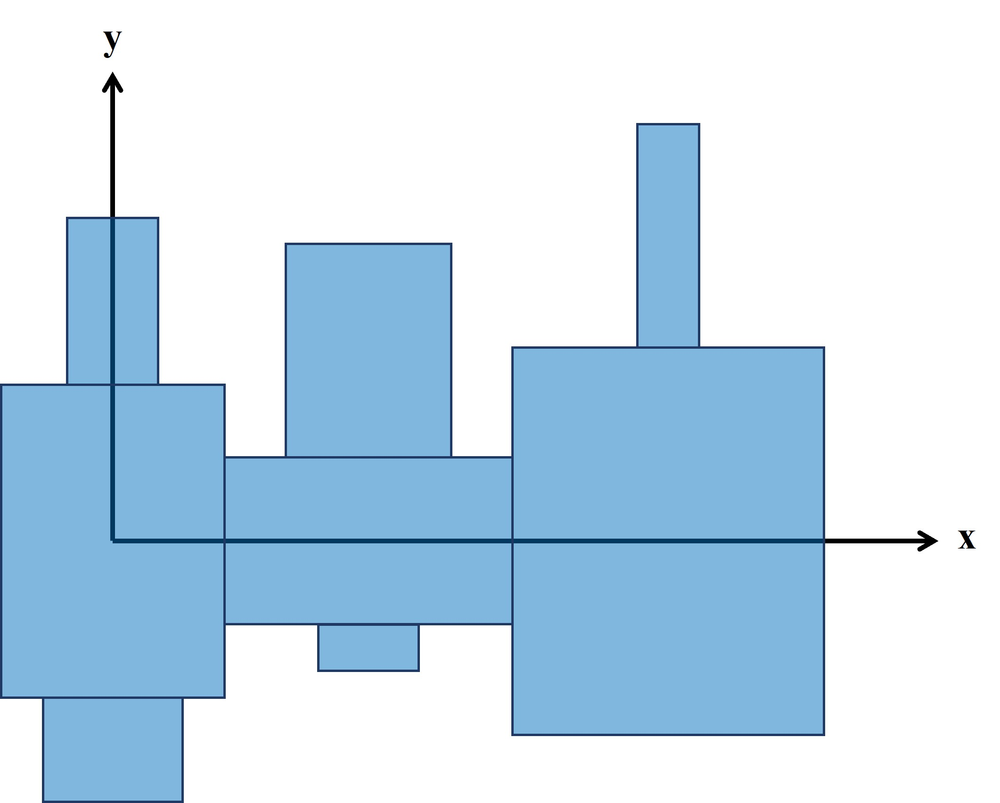
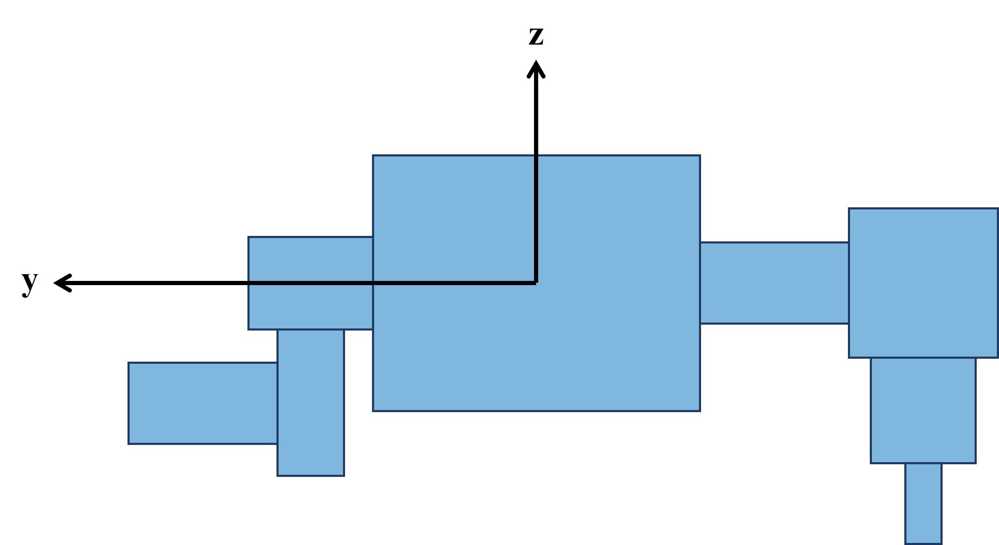
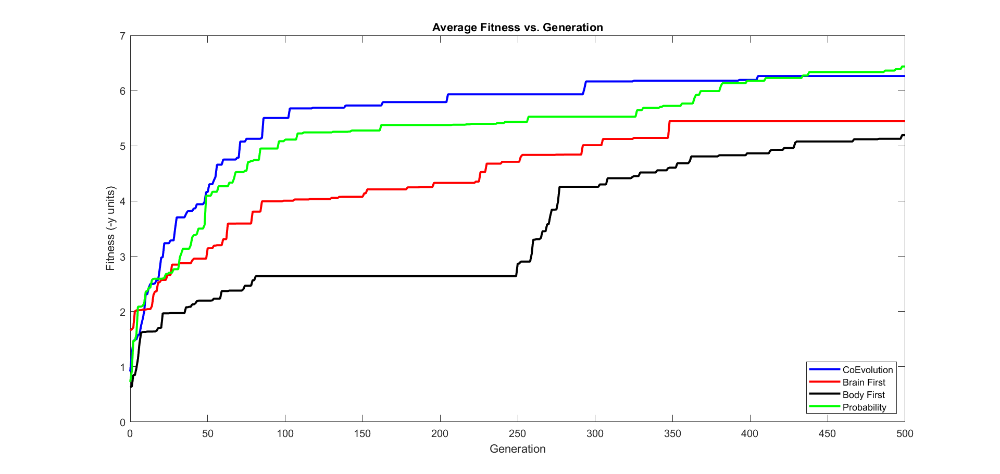

# **ME495-FinalProject**
 
## **Initial Creature Generation**
#### 
Leg links are grown from a "torso" link on each side face.  Each leg can have 0 to 4 links, growing either downward or outward to the side.  Between 1 and 5 "torsos" are created.

Joints are centered on the face of attachment.  Each joint has a randomized axis of rotation.  Each joint is motorized.

<p align="center">
    
</p>

This top view figure shows how torso vertebrae are grown and include an outward leg on 0 to 2 side faces.  Starting at the origin, a random number of vertebrae are grown in the +x direction.

<p align="center">
    
</p>

This front view figure shows how leg links are grown outward (+/-y direction) and downward (-z direction).  Quantity, growth direction, and axis of rotation are chosen randomly for each link.

 A random number of links between 3 and the total number of links are sensorized.  These links are represented with green.  Links without sensors are blue.

Motor neurons react based on random weights of sensor neurons.  

## **Background**
#### 
This project explores 4 different methods for evolution: co-evolution, brain first, body first, and single-event mutation.  The aspects of the robots that can evolve are the joint rotation axis, neuron weights, and whether a link is a sensor.  The joint axis mutations are considered body mutations where as the neuron weights and sensors are brain mutations. 

Co-evolution modifies all 3 mutations each generation.  Brain first evolves the brain for the first 250 generations, then evolves the body.  Body first is similar with mutations in the body first, then the brain.  The single-event evolution randomly chooses 1 of the 3 potential mutations each generation.

I hypothesize that the single-event mutation type will evolve creatures to have the highest fitness, as this type creates the smallest mutations each generation.

## **Experiment Design**
#### 
I added flags for each mutation that can be toggled to high depending on which evolution method is currently being tested and the current generation.  The co-evolution type is considered the control in this experiment as that type was used in Assignment 8.

Parallel hill climber was used to facilitate evolution of 10 parents across 500 generations.  Each evolution type was tested with the same set of 5 seeds.  This resulted in ~100,000 total simulations.

Fitness is determined by the end location of the first torso link in the y direction.  The fitness function for this experiment is the distance in the -y direction, shown by moving away from the camera in the simulation.  Parallel hill climber selects the more fit creature between a set of parent and child for each generation.

 ## **Results**
#### 
<p align="center">
    
</p>

MATLAB code for generating this plot can be found in the Data subfolder.


## **Discussion**
#### 
Further investigation into this experiment could include more mutation possibilities for the body.  This could create more interesting lineages and more fit creatures.


## **How to run**
#### 
1) Clone this repository
2) Install [pybullet](https://pybullet.org/wordpress/).  More information on getting started avaiable at the [Ludobots MOOC Installation](https://www.reddit.com/r/ludobots/wiki/installation/) page 
3) Navigate to this repository in command prompt
4) Run ```py search.py``` to run full code for 10 parents for 500 generations for each evolution type for 1 random seed.  Each evolution type will show the simulation for the best creature in the initial generation and the best overall creature design while waiting for input from the user to continue on with the next evolution type.

Additionally, all ~100,000 brain and body files are available in the Data subfolder and are seperated based on evolution type and random seed.  These can be used to watch the simulations used for analysis.


## **Sources**
#### 
- This project is a part of ME495 Artificial Life at Northwestern University.
- This course uses the [Ludobots MOOC](https://www.reddit.com/r/ludobots/) for coding projects